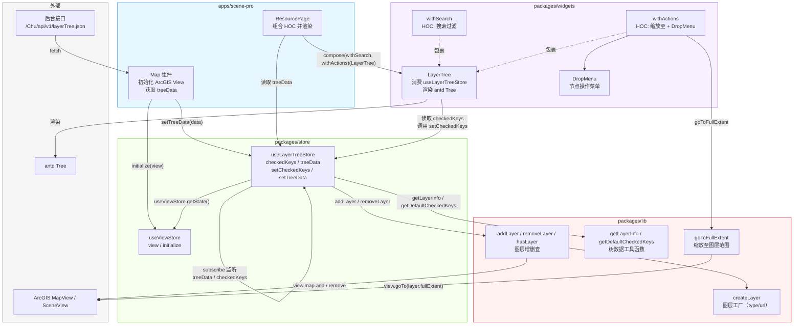
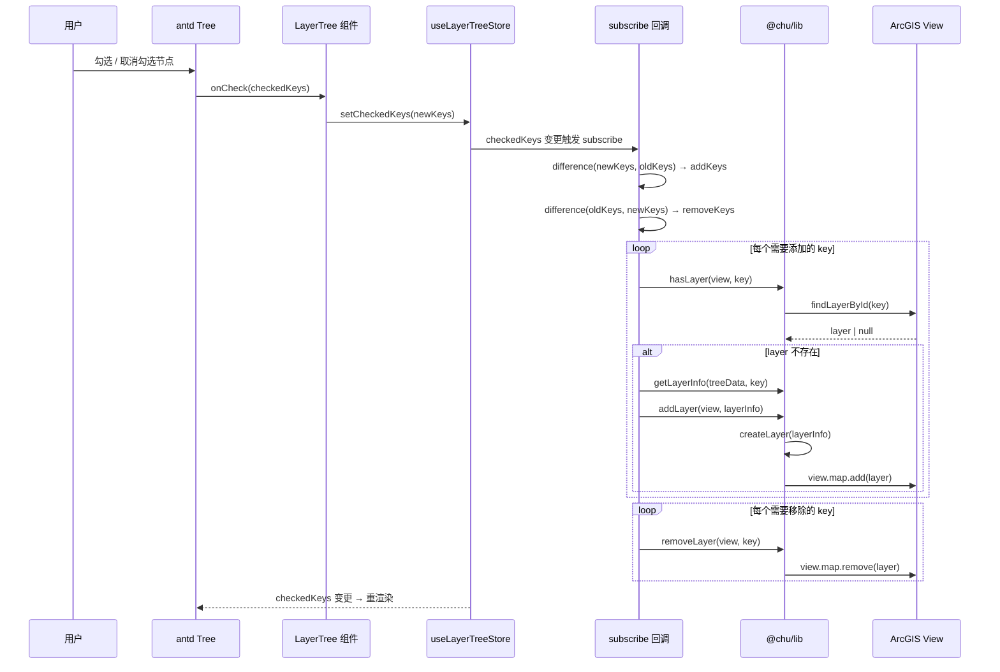
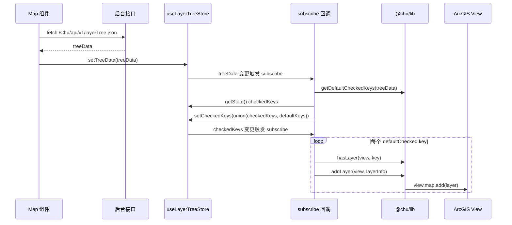

# 目录树设计与图层加载

## 需求

目录树的功能是多变的，可能以下的功能都需要实现

- 查询 [antd 示例](https://ant-design.antgroup.com/components/tree-cn#tree-demo-search)
- 懒加载 [antd示例](https://ant-design.antgroup.com/components/tree-cn#tree-demo-dynamic)
- 拖拽 [antd示例](https://ant-design.antgroup.com/components/tree-cn#tree-demo-draggable)
- 自定义图标 [antd示例](https://ant-design.antgroup.com/components/tree-cn#tree-demo-customized-icon)
- 默认勾选
- 节点操作，如 缩放至、 属性表等
- 联动，其他组件开关图层，同步给目录树
- 统计数值，比如xx类型(12个)
- 支持Group

图层加载的逻辑也是多变的，可能要满足以下情况

- 加载服务，同时加载关联服务（查询服务关联）
- 加载三维服务，同时加载二维服务（二三维关联）

数据源也是多变的，可能来自

- 配置文件：树
- 接口：树
- ~~接口：目录树+图层列表，前端构建树~~
- 接口：树 + 图层信息

## 图层控制

根据目录树的勾选，去加载/卸载图层。

## 设计思路

通过中间件，把**视图**、**数据获取**和**图层控制**逻辑做区分。

### 架构总览



### 用户勾选节点的数据流



### 初始化自动加载流程



## 实现过程

### store

store 中管理 `checkedKeys` 和 `treeData` 状态。使用 Zustand 的 `subscribeWithSelector` 中间件监听状态变更，替代了早期通过 middleware 拦截 action 的方式——action 和副作用不再耦合在同一个函数中。

`factory` 模式（`createLayerTreeStore`）替换了之前的 `storeCreator`：返回的是已经装配好订阅的完整 store，调用方无需手动绑定 middleware。

```javascript
import { create } from 'zustand';
import { subscribeWithSelector } from 'zustand/middleware';
import { difference, union } from 'ramda';
import { addLayer, getDefaultCheckedKeys, getLayerInfo, hasLayer, removeLayer } from '@chu/lib';
import useViewStore from './useViewStore';

const createLayerTreeStore = () => {
  const store = create(
    subscribeWithSelector((set) => ({
      checkedKeys: [],
      setCheckedKeys: (newCheckedKeys) => set({ checkedKeys: newCheckedKeys }),
      treeData: [],
      setTreeData: (newTreeData) => set({ treeData: newTreeData }),
    })),
  );

  // treeData 变更 → 自动勾选 defaultChecked 的节点
  store.subscribe(
    (state) => state.treeData,
    (newTreeData) => {
      const defaultKeys = getDefaultCheckedKeys(newTreeData);
      if (defaultKeys.length) {
        const { checkedKeys } = store.getState();
        store.getState().setCheckedKeys(union(checkedKeys, defaultKeys));
      }
    },
    { fireImmediately: false },
  );

  // checkedKeys 变更 → 加载/卸载图层
  store.subscribe(
    (state) => state.checkedKeys,
    (newKeys, oldKeys) => {
      const { view } = useViewStore.getState();
      const { treeData } = store.getState();

      const addKeys = difference(newKeys, oldKeys ?? []);
      const removeKeys = difference(oldKeys ?? [], newKeys);

      addKeys.forEach((key) => {
        if (!hasLayer(view, key)) {
          const layerInfo = getLayerInfo(treeData, key);
          if (layerInfo) addLayer(view, layerInfo);
        }
      });

      removeKeys.forEach((key) => removeLayer(view, key));
    },
    { fireImmediately: false },
  );

  return store;
};

// 默认单例
const useLayerTreeStore = createLayerTreeStore();

export { createLayerTreeStore };
export default useLayerTreeStore;
```

### lib

图层控制方法拆分到 lib 中。`createLayer` 独立成文件，通过 `supportLayerMap` 支持多种图层类型。

`packages/lib/src/core/layer/createLayer.js`：

```javascript
import Layer from '@arcgis/core/layers/Layer';
import FeatureLayer from '@arcgis/core/layers/FeatureLayer';
import GeoJSONLayer from '@arcgis/core/layers/GeoJSONLayer';
import GraphicsLayer from '@arcgis/core/layers/GraphicsLayer';
import ImageryLayer from '@arcgis/core/layers/ImageryLayer';
import ImageryTileLayer from '@arcgis/core/layers/ImageryTileLayer';
import IntegratedMesh3DTilesLayer from '@arcgis/core/layers/IntegratedMesh3DTilesLayer';
import MapImageLayer from '@arcgis/core/layers/MapImageLayer';
import TileLayer from '@arcgis/core/layers/TileLayer';
import VectorTileLayer from '@arcgis/core/layers/VectorTileLayer';
import GroupLayer from '@arcgis/core/layers/GroupLayer';
import { cond, has, T } from 'ramda';

const supportLayerMap = new Map([
  ['feature', FeatureLayer],
  ['geojson', GeoJSONLayer],
  ['graphics', GraphicsLayer],
  ['imagery', ImageryLayer],
  ['imagery-tile', ImageryTileLayer],
  ['integrated-mesh-3d-tiles', IntegratedMesh3DTilesLayer],
  ['map-image', MapImageLayer],
  ['tile', TileLayer],
  ['vector-tile', VectorTileLayer],
]);

const createLayerByUrl = async ({ key, url, ...rest }) =>
  await Layer.fromArcGISServerUrl({ url, properties: { id: key, ...rest } });

const createLayerByType = ({ type, key, ...rest }) => {
  if (type === 'group') {
    return createGroupLayer(rest);
  }
  const LayerClass = supportLayerMap.get(type);
  return new LayerClass({ id: key, ...rest });
};

const createGroupLayer = async ({ layers: layerInfos, key, ...rest }) => {
  const layers = await Promise.all(layerInfos.map(createLayer));
  return new GroupLayer({
    ...rest,
    id: key,
    layers,
  });
};

const createLayer = cond([
  [has('type'), createLayerByType],
  [has('url'), createLayerByUrl],
  [T, () => undefined],
]);

export default createLayer;
```

`packages/lib/src/core/layer/core.js`（图层增删查）：

```javascript
import createLayer from './createLayer';

export const hasLayer = (view, id) => {
  const layer = view.map.findLayerById(id);
  return !!layer;
};

export const addLayer = async (view, layerInfo) => {
  const layer = await createLayer(layerInfo);
  view.map.add(layer);
};

export const removeLayer = (view, id) => {
  const layer = view.map.findLayerById(id);
  view.map.remove(layer);
};
```

`packages/lib/src/core/layer/operation.js`（图层操作）：

```javascript
export const goToFullExtent = (view, id) => {
  const layer = view.map.findLayerById(id);
  if (layer) {
    view.goTo(layer.fullExtent);
  }
};
```

`packages/lib/src/core/layer/treeData.js`（树数据工具函数）：

```javascript
const findNode = (node, key) => {
  if (node.key === key) {
    return node;
  }

  if (node.children) {
    for (const child of node.children) {
      const found = findNode(child, key);
      if (found) {
        return found;
      }
    }
  }

  return null;
};

export const getLayerInfo = (treeData, key) => {
  const node = findNode({ children: treeData }, key);
  return node;
};

export const getDefaultCheckedKeys = (treeData) => {
  const keys = [];
  const traverse = (nodes) => {
    nodes.forEach((node) => {
      if (node.defaultChecked) {
        keys.push(node.key);
      }
      if (node.children) {
        traverse(node.children);
      }
      if (node.layers) {
        traverse(node.layers);
      }
    });
  };
  traverse(treeData);
  return keys;
};
```

### widgets

在 widgets 中，`LayerTree` 组件默认使用模块级单例 `useLayerTreeStore`，同时支持通过 `useStore` prop 注入独立的 store 实例。

`LayerTree.jsx`：

```javascript
import defaultUseLayerTreeStore from '@chu/store/useLayerTreeStore';
import { Tree } from 'antd';

const LayerTree = ({ treeData, useStore, ...rest }) => {
  const store = useStore ?? defaultUseLayerTreeStore;
  const { checkedKeys, setCheckedKeys } = store();

  const onCheck = (checkedKeysValue) => {
    setCheckedKeys(checkedKeysValue);
  };

  return (
    <Tree {...rest} checkable onCheck={onCheck} checkedKeys={checkedKeys} treeData={treeData} />
  );
};

export default LayerTree;
```

通过 **HOC** 的方式，可以对 `LayerTree` 进行功能增强。此处以查询图层树为例：

```javascript
import { isEmpty } from 'ramda';
import { Input, Space, Typography } from 'antd';
import { useMemo, useState } from 'react';
import styles from './index.less';

const { Search } = Input;
const { Text } = Typography;

const withSearch = (LayerTree) => {
  const WithSearch = ({ treeData: originTreeData, ...layerTreeRest }) => {
    const [expandedKeys, setExpandedKeys] = useState([]);
    const [searchValue, setSearchValue] = useState('');
    const [autoExpandParent, setAutoExpandParent] = useState(true);
    const treeData = useMemo(() => {
      const loop = (data) =>
        data.map(({ title: strTitle, key, children, count, ...rest }) => {
          const index = strTitle.indexOf(searchValue);
          const beforeStr = strTitle.substring(0, index);
          const afterStr = strTitle.slice(index + searchValue.length);
          const title =
            index > -1 ? (
              <Space>
                <span>
                  {beforeStr}
                  <Text type="danger">{searchValue}</Text>
                  {afterStr}
                </span>
                {count && count > 0 ? `(${count})` : null}
              </Space>
            ) : (
              <Space>
                <span>{strTitle}</span>
                {count && count > 0 ? `(${count})` : null}
              </Space>
            );
          if (children) {
            return {
              ...rest,
              title,
              key,
              children: loop(children),
            };
          }
          return {
            ...rest,
            title,
            key,
          };
        });
      return loop(originTreeData);
    }, [originTreeData, searchValue]);

    const onExpand = (newExpandedKeys) => {
      setExpandedKeys(newExpandedKeys);
      setAutoExpandParent(false);
    };
    const onSelect = (_, { node }) => {
      const isExpanded = expandedKeys.includes(node.key);

      const newExpandedKeys = isExpanded
        ? expandedKeys.filter((key) => key !== node.key)
        : [...expandedKeys, node.key];

      setExpandedKeys(newExpandedKeys);
    };
    const onChange = (e) => {
      const { value } = e.target;
      const newExpandedKeys = [];
      if (isEmpty(value)) {
        setExpandedKeys(newExpandedKeys);
        setSearchValue(value);
        setAutoExpandParent(true);
        return;
      }
      const loop = (node, parentId = '') => {
        if (node) {
          if (node.title.includes(value)) {
            newExpandedKeys.push(parentId);
          }
          if (node.children) {
            node.children.forEach((child) => loop(child, node.key));
          }
        }
      };
      originTreeData.forEach(loop);
      setExpandedKeys(newExpandedKeys);
      setSearchValue(value);
      setAutoExpandParent(true);
    };

    return (
      <div>
        <Search placeholder="请输入关键词搜索" onChange={onChange} className={styles.search} />
        <LayerTree
          {...layerTreeRest}
          treeData={treeData}
          onSelect={onSelect}
          onExpand={onExpand}
          expandedKeys={expandedKeys}
          autoExpandParent={autoExpandParent}
        />
      </div>
    );
  };
  return WithSearch;
};

export default withSearch;
```

## 高阶

**HOC** 组件组合，如 `withActions` 组件，在叶子节点上添加"缩放至"和操作菜单。`DropMenu` 只在传入 `dropMenuItems` 时条件渲染。

```javascript
import { GlobalOutlined } from '@ant-design/icons';
import { goToFullExtent } from '@chu/lib';
import useViewStore from '@chu/store/useViewStore';
import { Space } from 'antd';
import { useMemo } from 'react';
import DropMenu from './DropMenu';
import styles from './index.less';

const withActions = (LayerTree) => {
  const WithActions = ({ treeData: originTreeData, dropMenuItems = [], ...layerTreeRest }) => {
    const view = useViewStore((state) => state.view);
    const treeData = useMemo(() => {
      const loop = (data) =>
        data.map(({ children, key, ...rest }) => {
          const icon =
            children && children.length ? null : (
              <Space>
                <GlobalOutlined
                  onClick={(e) => {
                    e.stopPropagation();
                    goToFullExtent(view, key);
                  }}
                />
                {dropMenuItems?.length ? <DropMenu items={dropMenuItems} /> : null}
              </Space>
            );

          if (icon) {
            return { ...rest, key, isLeaf: true, icon };
          } else {
            return { ...rest, key, isLeaf: false, children: loop(children) };
          }
        });

      return loop(originTreeData);
    }, [originTreeData, dropMenuItems, view]);

    return (
      <div className={styles.container}>
        <LayerTree {...layerTreeRest} treeData={treeData} showIcon blockNode />
      </div>
    );
  };
  return WithActions;
};

export default withActions;
```

`DropMenu` 组件，使用 antd 的 `Dropdown` 实现：

```javascript
import { Dropdown } from 'antd';
import { MoreOutlined } from '@ant-design/icons';

const DropMenu = ({ items }) => {
  return (
    <Dropdown
      menu={{
        items,
      }}
    >
      <MoreOutlined />
    </Dropdown>
  );
};

export default DropMenu;
```

通过 `compose` 来组合，生成一个既有查询也有操作的 `LayerTree`：

```javascript
import LayerTree, { withSearch, withActions } from '@chu/widgets/LayerTree';
import { compose } from 'ramda';

const EnhancedLayerTree = compose(withSearch, withActions)(LayerTree);
```

### app

在 Map 组件中初始化时获取图层树数据并存入 Zustand store，`ResourcePage` 直接从 store 读取 `treeData`。

`apps/scene-pro/src/widgets/Map/index.js`：

```javascript
import esriConfig from '@arcgis/core/config.js';
import useViewStore from '@chu/store/useViewStore';
import useLayerTreeStore from '@chu/store/useLayerTreeStore';
import SceneView from '@arcgis/core/views/SceneView';
import Map from '@arcgis/core/Map';
import { useEffect, useRef } from 'react';
import styles from './index.less';
import getLayerTree from '@/services/getLayerTree.js';

esriConfig.assetsPath = './assets';

const MapComponent = () => {
  const initializeView = useViewStore((state) => state.initialize);
  const setTreeData = useLayerTreeStore((state) => state.setTreeData);
  const ref = useRef();

  useEffect(() => {
    const map = new Map({
      basemap: 'topo-3d',
      ground: 'world-elevation',
    });
    const view = new SceneView({
      map,
      zoom: 9,
      center: [120, 30],
      container: ref.current,
      ui: {
        components: [],
      },
      attributionVisible: false,
    });
    ref.current.view = view;

    view.when(() => {
      initializeView(view);
      getLayerTree().then(({ data }) => setTreeData(data));
    });
  }, [initializeView, setTreeData]);

  return <div id="view" ref={ref} className={styles.container} />;
};

export default MapComponent;
```

`apps/scene-pro/src/pages/Resource/index.js`：

```javascript
import Panel from '@chu/ui/Panel';
import LayerTree, { withSearch, withActions } from '@chu/widgets/LayerTree';
import useLayerTreeStore from '@chu/store/useLayerTreeStore';
import { Flex, message } from 'antd';
import { compose } from 'ramda';
import styles from './index.less';
import { filter, propEq } from 'ramda';
import config from './config';
import { HeartOutlined, DeleteOutlined } from '@ant-design/icons';

const EnhancedLayerTree = compose(withSearch, withActions)(LayerTree);

const ResourcePage = () => {
  const { treeData } = useLayerTreeStore();

  const items = filter(propEq('right', 'position'))(config);
  const dropMenuItems = [
    {
      label: '收藏',
      icon: <HeartOutlined />,
      key: 'favorite',
      onClick: () => {
        message.success(`收藏成功`);
      },
    },
    {
      label: '删除',
      icon: <DeleteOutlined />,
      key: 'delete',
      onClick: () => {
        message.success(`删除`);
      },
    },
  ];

  return (
    <div className={styles.container}>
      <div className={styles.left}>
        <Flex gap="large" vertical>
          <Panel title="目录树">
            <EnhancedLayerTree dropMenuItems={dropMenuItems} treeData={treeData} />
          </Panel>
        </Flex>
      </div>
      <div className={styles.right}>
        <Flex gap="large" vertical>
          {items.map(({ title, component }) => (
            <Panel key={title} title={title}>
              {component}
            </Panel>
          ))}
        </Flex>
      </div>
    </div>
  );
};

export default ResourcePage;
```

## 附件

补充 treeData 的样例，key 是唯一编码，可以给目录 count 属性，做统计用。节点支持 `defaultChecked: true` 用于初始加载时自动勾选。

```javascript
const data = [
  {
    key: '0f4621',
    url: 'https://earthquake.usgs.gov/earthquakes/feed/v1.0/summary/all_month.geojson',
    title: '地震',
    type: 'geojson',
    defaultChecked: true,
  },
  {
    key: 'dfa297',
    title: '组',
    type: 'group',
    layers: [
      {
        key: '1fdaih',
        url: 'https://earthquake.usgs.gov/earthquakes/feed/v1.0/summary/all_month.geojson',
        title: '地震1',
        type: 'geojson',
      },
      {
        key: '2dfudh',
        url: 'https://services.arcgis.com/V6ZHFr6zdgNZuVG0/arcgis/rest/services/Landscape_Trees/FeatureServer/0',
        title: '树木',
      },
    ],
  },
  {
    title: '要素服务',
    key: '3f4d6d',
    count: 2,
    children: [
      {
        key: 'f98djk',
        url: 'https://services.arcgis.com/V6ZHFr6zdgNZuVG0/arcgis/rest/services/Landscape_Trees/FeatureServer/0',
        title: '树木',
      },
      {
        key: 'dfssff',
        url: 'https://services.arcgis.com/V6ZHFr6zdgNZuVG0/ArcGIS/rest/services/128peaks/FeatureServer',
        title: '山峰',
      },
    ],
  },
  {
    title: '动态服务',
    key: '112jdf',
    count: 1,
    children: [
      {
        key: 'ffi132',
        url: 'https://sampleserver6.arcgisonline.com/arcgis/rest/services/Military/MapServer',
        title: 'DamageAssessment',
      },
    ],
  },
  {
    title: '切片服务',
    key: '39fjhh',
    count: 2,
    children: [
      {
        key: 'fuie38',
        url: 'https://basemaps.arcgis.com/arcgis/rest/services/World_Basemap_v2/VectorTileServer',
        title: '全球矢量切片',
      },
      {
        key: 'fu887d',
        url: 'https://services.arcgisonline.com/arcgis/rest/services/World_Terrain_Base/MapServer',
        title: '地形切片',
      },
    ],
  },
  {
    title: '三维服务',
    key: '3ofhuu',
    count: 4,
    children: [
      {
        key: 'dfjkkd',
        url: 'https://tiles.arcgis.com/tiles/V6ZHFr6zdgNZuVG0/arcgis/rest/services/Esri_Admin_Building/SceneServer',
        title: '建筑',
      },
      {
        key: 'dfiijh',
        url: 'https://tiles.arcgis.com/tiles/V6ZHFr6zdgNZuVG0/arcgis/rest/services/BARNEGAT_BAY_LiDAR_UTM/SceneServer',
        title: '点云',
      },
      {
        key: 'wejihh',
        url: 'https://services.arcgis.com/V6ZHFr6zdgNZuVG0/arcgis/rest/services/Paris_3D_Local_WSL2/SceneServer',
        title: '场景',
      },

      {
        key: '2ihfh9',
        url: 'https://tiles.arcgis.com/tiles/cFEFS0EWrhfDeVw9/arcgis/rest/services/Buildings_Frankfurt_2021/SceneServer',
        title: '倾斜',
      },
    ],
  },
];
```

## 多实例

当需要多个独立的 `LayerTree`（例如左侧"基础图层"和右侧"业务图层"各自管理勾选状态，但操作同一地图）时，可以在 app 层创建独立的 store 并通过 `useStore` prop 注入。

### 何时需要传 `useStore`

| 场景                                                             | 是否需要 `useStore`              |
| ---------------------------------------------------------------- | -------------------------------- |
| 页面上只有一个目录树                                             | **不需要**，默认单例即可         |
| 多个目录树，但共享勾选状态（如两个面板展示同一棵树的 A/B 视图）  | **不需要**，它们应共用一个 store |
| 多个目录树，各有独立的 `treeData` 和独立的勾选状态               | **需要**，每个树传入自己的 store |
| 多个目录树操作同一地图，但勾选互不干扰（如基础图层 vs 业务图层） | **需要**                         |

判断标准很简单：**想让两个 `LayerTree` 的勾选框各自独立、互不影响，就各传一个 `useStore`；想让它们同步勾选，就共用同一个 store（或不传，都用默认单例）。**

`createLayerTreeStore()` 每次调用都返回一个已装配好订阅的独立 store：

```javascript
import { createLayerTreeStore } from '@chu/store';
import LayerTree, { withSearch, withActions } from '@chu/widgets/LayerTree';
import { compose } from 'ramda';
import { useMemo } from 'react';

const EnhancedLayerTree = compose(withSearch, withActions)(LayerTree);

const MultiTreePage = () => {
  const useBaseStore = useMemo(() => createLayerTreeStore(), []);
  const useBizStore = useMemo(() => createLayerTreeStore(), []);

  return (
    <div style={{ display: 'flex', gap: 16 }}>
      <Panel title="基础图层">
        <EnhancedLayerTree treeData={baseTreeData} useStore={useBaseStore} />
      </Panel>
      <Panel title="业务图层">
        <EnhancedLayerTree treeData={bizTreeData} useStore={useBizStore} />
      </Panel>
    </div>
  );
};
```

每个 store 内部已通过 `subscribe` 绑定了图层加载逻辑，各自维护 `checkedKeys`，但都操作同一个全局 `view`（从 `useViewStore` 获取），所以图层加载/卸载最终作用于同一张地图。

不传 `useStore` 时，`LayerTree` 退回到默认的单例 store，现有代码无需改动。

## 后台接口字段对接

图层树的字段限制了后台接口字段。在 `apps/scene-pro/src/utils/normalizeLayerTree.js` 中增加转接器，将后台数据转成 mock 数据中的树结构，使用设定的字段名称。

示例代码：

```js
const typeMap = new Map([
  ['FeatureServer', 'feature'],
  ['SceneLayer', 'scene'],
]);

const transformNode = (node) => {
  const isCatalogNode = node.type === 'catalog' || node.show === 'expand';
  return isCatalogNode ? catalog2menu(node) : layer2menu(node);
};

const catalog2menu = (node) => {
  const { name, id, children, resource, show } = node;

  return {
    key: id,
    title: name,
    children: show ? resource?.map(transformNode) : children?.map(transformNode),
  };
};

const layer2menu = (node) => {
  const { show } = node;
  return show === 'merge' ? group(node) : normal(node);
};

const group = (node) => {
  const { id, name, resource } = node;
  return {
    key: id,
    type: 'group',
    title: name,
    layers: resource?.map(transformNode),
  };
};

const normal = (node) => {
  const { rid, name, type, url } = node;
  return {
    key: rid,
    url: url,
    type: typeMap.get(type) || 'map-image',
    title: name,
  };
};

const normalizeLayerTree = (data) => {
  return data.map(transformNode);
};

export default normalizeLayerTree;
```
